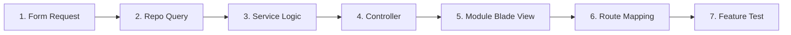

# HƯỚNG DẪN KIẾN TRÚC & QUY CHUẨN CODE (CODING GUIDELINES)

> **Tài liệu bắt buộc cho toàn bộ thành viên dự án Camera Store.**  
> Đọc kỹ trước khi bắt tay vào code bất kỳ module hay chức năng nào để đảm bảo tính nhất quán, sạch sẽ và dễ bảo trì.

---

## 1. TỔNG QUAN KIẾN TRÚC MODULAR 3-LAYER (`app/modules/`)

Hệ thống được tổ chức theo từng **Module tính năng độc lập** (Auth, User, Product, Category, Cart, Order, ...) nằm trong thư mục `app/modules/`. Mỗi module bao gồm 4 thành phần chính:

```
app/modules/<TênModule>/
├── Controllers/      # Tiếp nhận HTTP Request & trả về Blade View / Redirect
├── Services/         # Xử lý 100% Logic nghiệp vụ
├── Repositories/     # Đảm nhiệm 100% Truy vấn Cơ sở dữ liệu (Eloquent)
└── Requests/         # Form Request xác thực & Validate dữ liệu đầu vào
```

---

## 2. CẤU TRÚC THƯ MỤC GIAO DIỆN THEO MODULE (`resources/views/`)

Thư mục giao diện Blade được đồng bộ cấu trúc 1:1 theo Module Backend. Mỗi Module trong `resources/views/modules/<TênModule>/` bắt buộc phải được tổ chức thành **3 thành phần chuẩn**:

```
resources/views/
├── modules/
│   └── <TênModule>/
│       ├── pages/        # Màn hình / Trang view chính (index, show, create, edit...)
│       ├── components/   # UI Component, Card, Table, Form, Modal dùng riêng cho module
│       └── services/     # File Script / Client-side JS / Blade Service phục vụ giao diện module
├── components/           # Các UI Component toàn cục (<x-form-input />, <x-alert />, <x-primary-button />...)
├── layouts/              # Khung layout chính (app.blade.php, guest.blade.php, navigation.blade.php)
└── errors/               # Các trang thông báo lỗi HTML (404.blade.php, 403.blade.php, 500.blade.php)
```

- **Chi tiết 3 thành phần trong mỗi Module:**
  1. **`pages/`**: Nơi chứa các file Blade đại diện cho toàn bộ trang view chính mà Controller trả về (`index.blade.php`, `show.blade.php`, `create.blade.php`, `edit.blade.php`...).
  2. **`components/`**: Nơi chứa các component con hoặc partials nhỏ được tái sử dụng bên trong các trang của module (ví dụ: `<module>-card.blade.php`, `<module>-table.blade.php`, `<module>-filter.blade.php`...).
  3. **`services/`**: Nơi chứa các đoạn script client-side JS / Blade Service xử lý logic giao diện (AJAX request, realtime event, validate client, tính toán tức thời...) của module.

- **Quy tắc gọi view trong Controller:** Bắt buộc sử dụng cú pháp:
  ```php
  return view('modules.<TênModule>.pages.<tên_trang>', compact(...));
  ```
  *Ví dụ:*
  - `return view('modules.Auth.pages.login');`
  - `return view('modules.Product.pages.index', compact('products'));`
  - `return view('modules.Order.pages.checkout', compact('cart'));`
  - `return view('modules.User.pages.edit', compact('user'));`

---

## 3. QUY CHUẨN CODE GIAO DIỆN BLADE & VIEWS (VIEW CODING STYLE)

### 3.1. Kế thừa Layout & Cấu trúc trang chuẩn
Mọi trang giao diện phải kế thừa từ một trong hai layout chuẩn:
- `<x-app-layout>`: Dành cho các trang chính sau đăng nhập, trang quản trị, trang khách hàng.
- `<x-guest-layout>`: Dành cho các trang xác thực (login, register, forgot password...).

```blade
{{-- Ví dụ cấu trúc chuẩn của một trang Blade --}}
<x-app-layout>
    <x-slot name="header">
        <h2 class="font-semibold text-xl text-gray-800 leading-tight">
            {{ __('Danh sách sản phẩm') }}
        </h2>
    </x-slot>

    <div class="py-12">
        <div class="max-w-7xl mx-auto sm:px-6 lg:px-8">
            <div class="bg-white overflow-hidden shadow-sm sm:rounded-lg p-6">
                {{-- Nội dung trang ở đây --}}
            </div>
        </div>
    </div>
</x-app-layout>
```

---

### 3.2. Hệ thống UI Components & Tự động Validate Form (Auto UI Error Feedback)
Hệ thống cung cấp sẵn các Blade Components được tích hợp cơ chế **tự động kiểm tra lỗi validation, tự động chuyển viền đỏ, giữ giá trị cũ (old value) và hiển thị thông báo lỗi Tiếng Việt**:

#### Danh mục Components có sẵn trong `resources/views/components/`:

| Component | Mục đích sử dụng | Đặc điểm nổi bật |
|---|---|---|
| `<x-form-input />` | **Input 3-in-1** (Gồm Label + Input + Error text) | Tự động viền đỏ khi có lỗi, tự động điền `old('name')`, tự render `<x-input-error>` |
| `<x-form-textarea />` | **Textarea 3-in-1** | Tự động viền đỏ, giữ `old()`, tự render lỗi |
| `<x-form-select />` | **Select Dropdown 3-in-1** | Hỗ trợ mảng options `:options="['key' => 'val']"`, tự động chọn lại option cũ `old()` |
| `<x-alert />` | Flash Alert banner toàn cục | Tự động bắt `session('success')`, `session('error')`, nhúng sẵn trong layout |
| `<x-text-input />` | Ô input đơn lẻ | Tự động thêm viền đỏ (`border-red-500`) khi `$errors->has($name)` |
| `<x-input-error />` | Thông báo lỗi | Hỗ trợ cả `for="field_name"` hoặc `:messages="$errors->get('field_name')"` |
| `<x-input-label />` | Nhãn của ô nhập liệu | Hỗ trợ thuộc tính `required` (tự thêm dấu `*` đỏ) |
| `<x-primary-button>` | Nút bấm chính (Xanh đậm/Đen) | Nút submit form hoặc hành động chính |
| `<x-secondary-button>` | Nút bấm phụ (Xám/Viền) | Nút hủy bỏ / quay lại |
| `<x-danger-button>` | Nút hành động nguy hiểm | Nút xóa / thao tác nhạy cảm |

---

### 3.3. Hướng dẫn viết Form chuẩn & Tự động báo lỗi trên Form

#### Cách 1: Sử dụng Component trọn gói 3-in-1 `<x-form-input>` (Khuyên dùng nhất - Tiết kiệm 80% code)
Không cần viết lặp lại label hay input-error, chỉ 1 dòng là đầy đủ:
```blade
<form method="POST" action="{{ route('admin.products.store') }}" enctype="multipart/form-data">
    @csrf

    <!-- Tự động có Label có dấu *, tự viền đỏ khi sai, tự điền old('name'), tự hiện lỗi Tiếng Việt -->
    <x-form-input 
        name="name" 
        label="Tên sản phẩm" 
        type="text" 
        placeholder="Nhập tên sản phẩm..." 
        required 
    />

    <x-form-input 
        name="price" 
        label="Giá bán (VNĐ)" 
        type="number" 
        placeholder="0" 
        required 
    />

    <x-form-select 
        name="category_id" 
        label="Danh mục sản phẩm" 
        :options="$categories->pluck('name', 'id')" 
        placeholder="-- Chọn danh mục --"
        required 
    />

    <x-form-textarea 
        name="description" 
        label="Mô tả chi tiết" 
        rows="4" 
        placeholder="Nhập mô tả sản phẩm..." 
    />

    <div class="mt-6 flex items-center gap-4">
        <x-primary-button>Lưu sản phẩm</x-primary-button>
        <a href="{{ route('admin.products.index') }}" class="text-sm text-gray-600 hover:text-gray-900">Hủy</a>
    </div>
</form>
```

#### Cách 2: Sử dụng các Components đơn lẻ linh hoạt
Khi cần tùy biến layout đặc thù:
```blade
<div class="mb-4">
    <x-input-label for="email" :value="__('Email')" required />
    <!-- Tự động viền đỏ khi validation trường 'email' thất bại -->
    <x-text-input id="email" name="email" type="email" class="mt-1 block w-full" :value="old('email')" required />
    <!-- Hiển thị text lỗi Tiếng Việt ngay dưới ô -->
    <x-input-error for="email" class="mt-2" />
</div>
```

---

### 3.4. Quy chuẩn Form, Dữ liệu & Bảo mật trong Blade

1. **Bảo mật CSRF:** Mọi form HTML có method `POST`, `PUT`, `PATCH`, `DELETE` **BẮT BUỘC** phải có `@csrf`.
2. **Method Spoofing:** Với các request `PUT`, `PATCH`, `DELETE`, dùng `@method('PUT')` hoặc `@method('DELETE')`.
3. **Giữ lại dữ liệu cũ khi submit lỗi:** Luôn dùng `old('field_name', $defaultValue)` trong thuộc tính `value` của input (đã tích hợp sẵn trong `<x-form-input>`).
4. **Hiển thị dữ liệu an toàn:** Luôn dùng `{{ $data }}` để chống XSS. Chỉ dùng `{!! $rawHtml !!}` khi nội dung đã được xử lý an toàn.
5. **Định dạng tiền tệ & thời gian:** Format trước tại Model Accessor hoặc dùng helper `number_format($product->price, 0, ',', '.') . ' đ'`.

---

### 3.4. Vòng lặp & Điều kiện hiển thị (Directives chuẩn)
- Dùng `@forelse ... @empty ... @endforelse` thay vì `@if(count > 0) @foreach` khi duyệt danh sách:
```blade
<div class="grid grid-cols-1 md:grid-cols-3 gap-6">
    @forelse ($products as $product)
        <div class="border rounded-lg p-4">
            <h3 class="font-bold">{{ $product->name }}</h3>
            <p class="text-indigo-600">{{ number_format($product->price) }} đ</p>
        </div>
    @empty
        <p class="text-gray-500 col-span-3 text-center py-8">Chưa có sản phẩm nào.</p>
    @endforelse
</div>

{{-- Hiển thị phân trang chuẩn Bootstrap/Tailwind --}}
<div class="mt-6">
    {{ $products->links() }}
</div>
```

---

### 3.5. ❌ CÁC ĐIỀU CẤM KỴ KHI VIẾT BLADE VIEW

| ❌ ĐIỀU TUYỆT ĐỐI CẤM | ✅ CÁCH LÀM ĐÚNG |
|---|---|
| **CẤM query Database trong file Blade** (`Product::all()`, `Category::where(...)`) | Lấy dữ liệu từ **Controller ➔ truyền qua View** |
| **CẤM gọi quan hệ gây lỗi N+1 trong vòng lặp** (ví dụ `$product->orders()->count()`) | Eager load từ Repository bằng `with('category')`, `withCount('orders')` |
| **CẤM viết logic tính tiền, trừ kho, tính giảm giá trong Blade** | Đưa vào tầng **Service** hoặc viết **Accessor** trong Model |
| **CẤM viết mã PHP thuần `<?php ... ?>` rải rác** | Dùng các directive Blade (`@if`, `@foreach`, `@auth`) |
| **CẤM viết CSS inline `style="..."` hoặc thẻ `<script>` lớn** | Dùng Tailwind CSS utility classes hoặc nhúng file JS qua `@vite` |

---

## 4. QUY ĐỊNH CHI TIẾT CÁC TẦNG BACKEND (`app/modules/`)

### 4.1. Tầng Form Request (`Requests/`)
- **Nhiệm vụ:** Validate toàn bộ dữ liệu người dùng gửi lên trước khi vào Controller.
- **Quy tắc:**
  - `authorize()` phải trả về `true` (nếu đã qua Middleware phân quyền).
  - Viết đầy đủ hàm `messages()` với thông báo lỗi rõ ràng bằng **Tiếng Việt**.
  - Khi người dùng nhập sai, Form Request tự động chuyển hướng quay lại trang cũ kèm mảng lỗi `$errors`.

---

### 4.2. Tầng Controller (`Controllers/`)
- **Nhiệm vụ:** Nhận dữ liệu đã validate từ Request, gọi Service tương ứng, và trả về `view(...)` hoặc `redirect(...)`.
- **Quy tắc VÀNG:**
  - ❌ **CẤM viết logic nghiệp vụ** trong Controller.
  - ❌ **CẤM gọi trực tiếp Eloquent Model** để query DB trong Controller.
  - ❌ **CẤM viết khối `try-catch`** (đã có Global Exception Filter xử lý).
  - Trả về View bằng `return view('modules.<Module>.<name>', compact(...))` hoặc chuyển hướng kèm thông báo `return redirect()->route(...)->with('success', 'Thành công!')`.

---

### 4.3. Tầng Service (`Services/`)
- **Nhiệm vụ:** Trọng tâm của toàn bộ ứng dụng — thực thi tất cả các quy tắc nghiệp vụ.
- **Quy tắc:**
  - Kiểm tra điều kiện logic (tồn kho, trạng thái hợp lệ, coupon còn hạn...).
  - Quản lý Database Transaction (`DB::transaction(...)`) khi ghi nhiều bảng.
  - Khi phát hiện vi phạm nghiệp vụ: **Hãy `throw Exception` ngay lập tức** (`BusinessException`, `BadRequestException`, `ResourceNotFoundException`).

---

### 4.4. Tầng Repository (`Repositories/`)
- **Nhiệm vụ:** Nơi duy nhất chứa các câu lệnh truy vấn Database qua Eloquent Model.
- **Quy tắc:**
  - Tách biệt hoàn toàn câu truy vấn SQL / Eloquent khỏi Service và Controller.
  - Tên phương thức rõ ràng: `getAll()`, `findById()`, `create()`, `update()`, `delete()`.

---

## 5. GLOBAL EXCEPTION FILTER DÀNH CHO MVC (WEB & BLADE)

Hệ thống đã có **Global Exception Handler** cấu hình tại `bootstrap/app.php` và `app/Exceptions/GlobalExceptionHandler.php`.

### ⚠️ QUY TẮC BẮT BUỘC: TUYỆT ĐỐI KHÔNG DÙNG `try-catch` THỦ CÔNG
- Khi cần báo lỗi, chỉ cần **`throw`** loại Exception phù hợp. Hệ thống sẽ tự động bắt và xử lý theo chuẩn MVC:
  - Tự động **Redirect quay lại trang cũ** kèm Flash Session `session('error')`.
  - Tự động hiển thị trang giao diện lỗi đẹp mắt (`404.blade.php`, `403.blade.php`, `500.blade.php`).

### 🎯 Danh sách Exception có sẵn & Hành vi trên giao diện Blade:

| Exception Class | Mã HTTP | Hành vi trên Giao diện Web (Blade) | Ví dụ ném lỗi trong Service |
|---|---|---|---|
| `BusinessException` | 422 | Tự động **Redirect back** kèm thông báo lỗi đỏ `session('error')` | `throw new BusinessException('Sản phẩm đã hết hàng trong kho!');` |
| `BadRequestException` | 400 | Tự động **Redirect back** kèm thông báo lỗi đỏ `session('error')` | `throw new BadRequestException('Mã giảm giá đã hết hạn sử dụng!');` |
| `ResourceNotFoundException` | 404 | Tự động render trang giao diện lỗi **`404.blade.php`** | `throw new ResourceNotFoundException('Không tìm thấy sản phẩm');` |
| `ForbiddenException` | 403 | Tự động render trang giao diện lỗi **`403.blade.php`** | `throw new ForbiddenException('Bạn không có quyền truy cập');` |
| `UnauthorizedException` | 401 | Tự động **Redirect về trang Login** kèm thông báo yêu cầu đăng nhập | `throw new UnauthorizedException();` |
| `ValidationException` | 422 | Tự động **Redirect back** kèm mảng lỗi đỏ `$errors` dưới từng ô input | *(Tự động kích hoạt khi FormRequest validate thất bại)* |

---

---

## 6. TỰ ĐỘNG GHI AUDIT LOG & CHE GIẤU DỮ LIỆU NHẠY CẢM (DATA MASKING)

Hệ thống tích hợp sẵn tầng **AUDIT LOG** thông qua [`GlobalRequestLogger`](file:///d:/PHP_CameraStore/app/Http/Middleware/GlobalRequestLogger.php) và [`DataMasker`](file:///d:/PHP_CameraStore/app/Support/DataMasker.php).

### 6.1. Nguyên lý hoạt động AUDIT LOG:
- **Tự động 100%:** Được khai báo toàn cục trong `bootstrap/app.php`, tự động đón đầu mọi HTTP Request (Web, API, Form submit, Ajax) mà **không cần viết code log rải rác trong Controller**.
- **Metrics ghi nhận:**
  - `request_id`: Mã định danh UUID duy nhất cho từng Request để truy vết lỗi xuyên suốt hệ thống.
  - `method`, `url`, `path`, `route`, `controller_action`.
  - `ip`, `user_agent`, `user` (ID, Email, Role nếu đã đăng nhập).
  - `status`: HTTP Status Code (200, 302, 400, 422, 500).
  - `duration`: Thời gian xử lý request chính xác theo miligiây (`ms`).
  - `memory_peak`: Bộ nhớ RAM tiêu thụ (`MB`).
- **Phân loại Level tự động:**
  - `2xx`, `3xx` ➔ Ghi nhận mức `INFO`.
  - `4xx` (Client error, Validation error) ➔ Ghi nhận mức `WARNING`.
  - `5xx` (Server error) ➔ Ghi nhận mức `ERROR`.

---

### 6.2. Cơ chế Che giấu dữ liệu nhạy cảm Toàn cục (Global Data Masking):
Bất kỳ dữ liệu nào gửi lên qua Header, Query String, Form Data, Body Payload, hay JSON đều đi qua bộ lọc đệ quy đa tầng:

1. **Khớp danh sách trường nhạy cảm chính xác:**  
   `password`, `password_confirmation`, `current_password`, `token`, `access_token`, `refresh_token`, `api_key`, `secret`, `cvv`, `cvc`, `pin`, `ssn`, `bank_account`, `card_number`, `otp`, `private_key`... ➔ Tự động đổi thành `******`.
2. **Khớp động theo Pattern Regex (Kể cả trường mới chưa khai báo):**  
   Bất kỳ key nào có chứa các từ khóa nhạy cảm (như `user_password_hash`, `client_secret_key`, `payment_card_cvv`, `device_auth_token`, `my_otp_code`...) ➔ Đều tự động bị nhận diện và đổi thành `******`.
3. **Che giấu Header & Chuỗi ký tự:**  
   Authorization Bearer Tokens (`Bearer eyJ...`) và dãy số thẻ ngân hàng nằm trong chuỗi văn bản tự động được che giấu an toàn.
4. **Cấu hình tùy biến:**  
   Có thể mở rộng thêm trường hoặc loại trừ route thông qua file cấu hình [`config/audit.php`](file:///d:/PHP_CameraStore/config/audit.php).

---

## 7. TRÌNH TỰ CODE MỘT CHỨC NĂNG MỚI (STEP-BY-STEP)



1. **Bước 1 (Request):** Viết Form Request validate dữ liệu trong `app/modules/<Module>/Requests/`.
2. **Bước 2 (Repository):** Viết hàm truy vấn DB trong `app/modules/<Module>/Repositories/`.
3. **Bước 3 (Service):** Viết hàm nghiệp vụ trong `app/modules/<Module>/Services/` (ném Exception khi sai).
4. **Bước 4 (Controller):** Nhận dữ liệu, gọi Service, trả về `view('modules.<Module>.<name>')` hoặc `redirect()->with('success', ...)`.
5. **Bước 5 (View):** Tạo giao diện Blade kế thừa `<x-app-layout>`, dùng UI components `<x-form-input>`, `<x-primary-button>`.
6. **Bước 6 (Route):** Khai báo Route trong `routes/web.php`.
7. **Bước 7 (Test):** Viết Feature Test trong `tests/Feature/` và chạy `php artisan test`.
